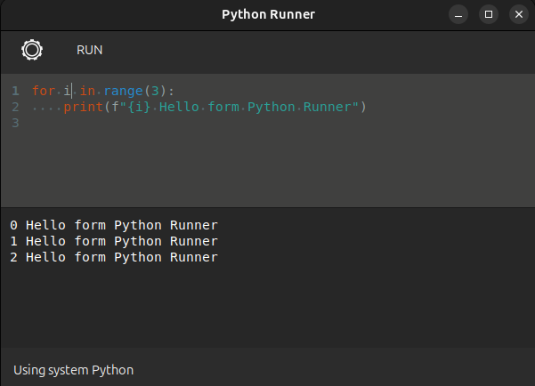

# Python Runner

Simple python code runner for linux based on GTK-3, for quick experiments and tries.

Features:

1. Support selection of custom venv
2. Support several tabs
3. Hotkey based controls
